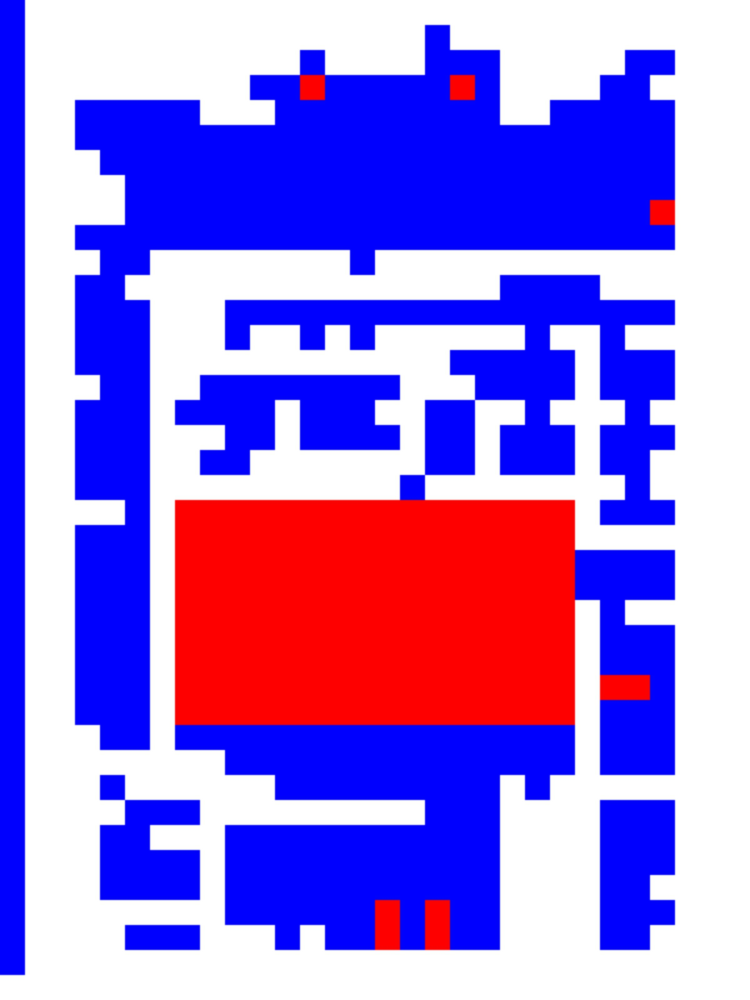
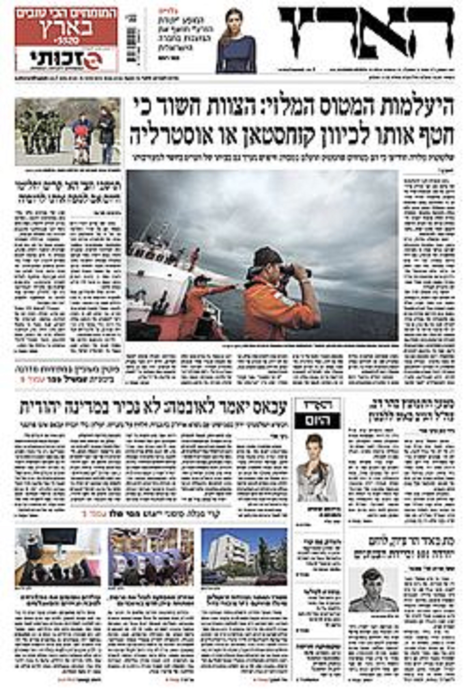
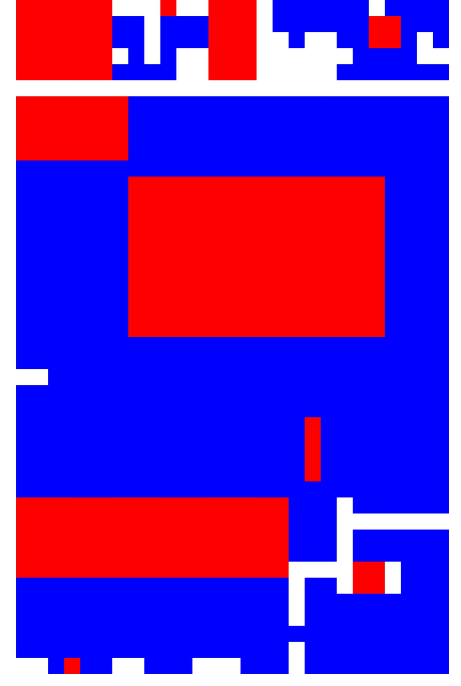
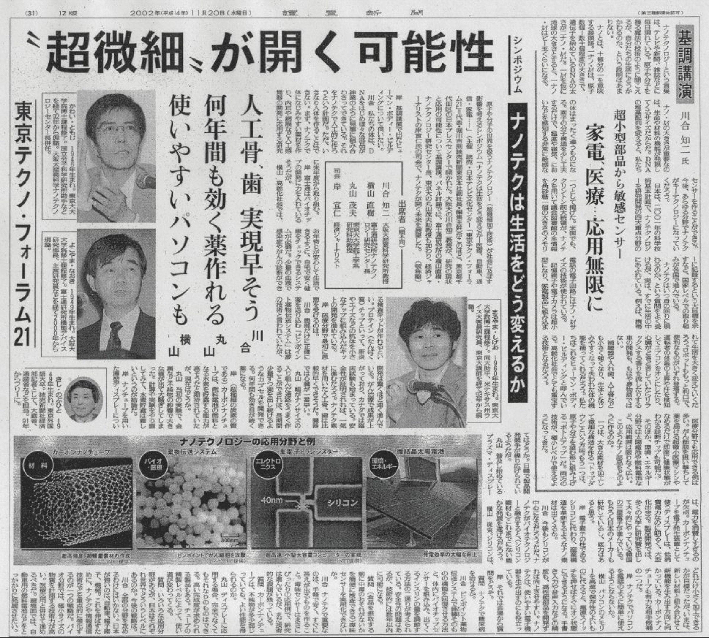
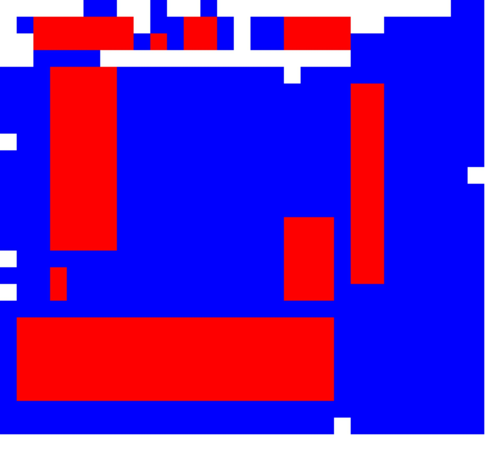

# Machine Learning for NewsPapers clustering

This work has been achieved during my [Data Scientist program](https://github.com/ykacer/CES_Data_Scientist_2016/tree/master/14_apprentissage_non_supervise-part2/Project) 
 at Telecom ParisTech. We create here a Github repo for this project, to make it more visible. 

Feel free to [contact](youcef.kacer@gmail.com) me if you have any question.

## Description

This project aims at clustering a newspapers page into 3 categories

* text
* image
* white background

## Dataset

The used dataset is an ensemble of 102 Russian newpapers pages annotated and 
taken from [UCL Machine learning](https://archive.ics.uci.edu/ml/machine-learning-databases/00306/) site.
This is the dataset we used to tune descriptors extraction parameters, patch window size, clustering parameters.

We show below an example with ground truth:

#### page

  

#### ground truth

  

## Method

We propose to cut a given page into squared patchs (possibly overlapped).

We then propose to extract a descriptor for each patch. Two different possible descriptors have been developed :

* Histogram of Oriented Gradients
* Hue/Saturation/Value histogram 
* Gradient flattened
* Concatenation of two or three descriptors from above

The resulting set of features is finally clustered following one of the methods below :

* Principal Component Analysis
* Non-Negative Matrix Factorization
* KMeans

Here after, we presente the result of our method applied to the example above :

#### page

  

#### ground truth

  

#### clustering (gradient+HSV - KMeans)

  

## Repository

### utils.py 

This file contains some utilities to cut image and post process clustering results (**scikit-image**)

### functions.py

This file gathers all core functions that extract features (**OpenCV**, **scikit-learn**)

### run.py

This file download the dataset, untar it and run clustering. It displays precision/recall performance for each processed page.
To run the process :

  `python run.py`

### test.py

This file allows you to test whatever page scanned from newspapers. You then obtain resulting clustering in the same repository.
Parameters can be tuned at the beginning of the file (like patch window size, optional image resizing factor, kind of descriptors).
To run test :

 `python test.py nom_image.[jpg|png|bmp|tif]`

Here after, we show testing results with other languages to verify the generalization of the method.

#### arabic (HoG+HSV - KMeans)

  
  

#### hebraic (HoG+HSV - KMeans)

  
  

#### japanese (HoG+HSV - KMeans)

  
  

